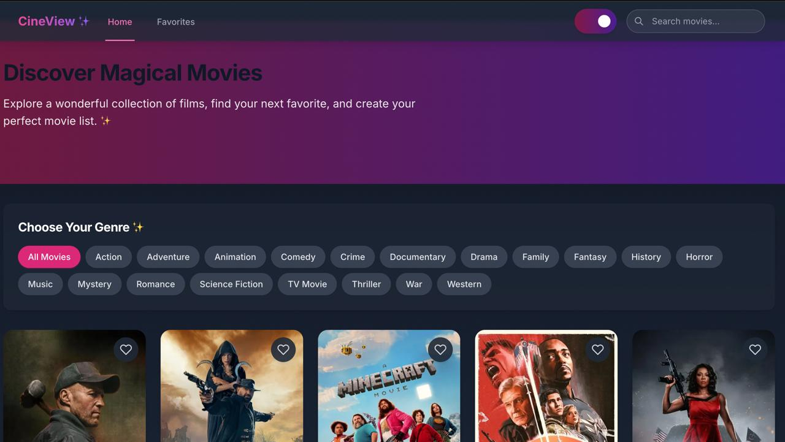
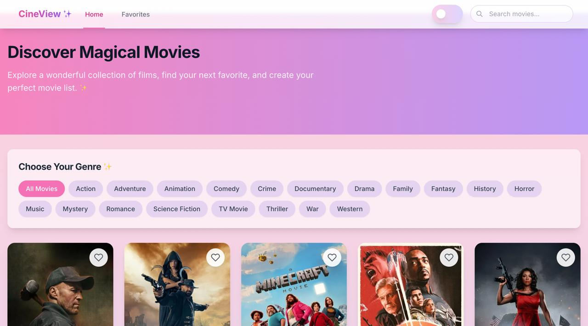
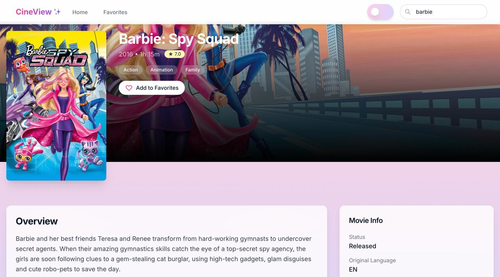
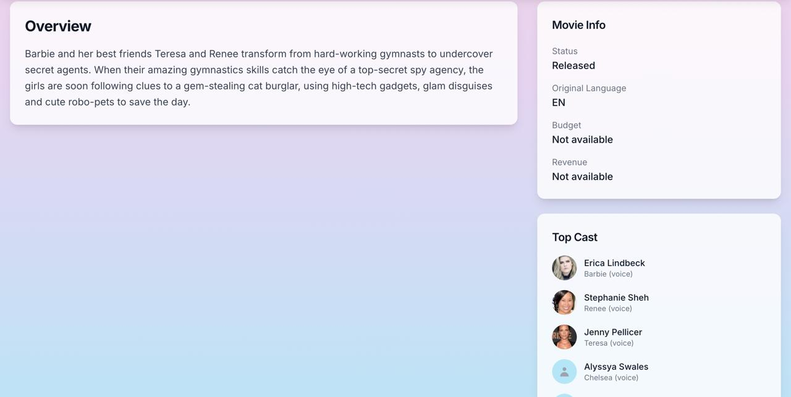
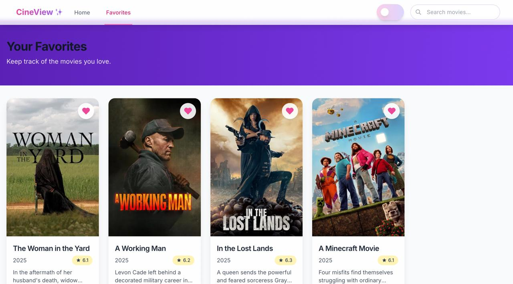

# 🎬 CineView

## 📖 Description

**CineView** is a modern movie recommendation web app built with Vite + React. Users can browse movies, view top cast and max revenue, filter by genres, and manage their favorites. Built using functional components, hooks, Context API, and Tailwind CSS, CineView is fast, responsive, and user-friendly.

---

## ✨ Features

- 🎞️ Browse a collection of movies  
- 👥 View top cast and max revenue for each movie  
- ❤️ Add/remove movies from a favorites list  
- 🎭 Sort/filter movies by genre  
- ✅ Form with input validation  
- 📱 Responsive design (mobile + desktop)  
- 🔁 Reusable, modular components  
- 🌐 Multi-page routing using React Router  

---

## 🛠 Tech Stack

- **Frontend:** Vite + React.js (Functional Components + Hooks)  
- **Routing:** React Router DOM  
- **State Management:** React Context API  
- **Styling:** Tailwind CSS  
- **Version Control:** Git & GitHub  
- **API Source:** TMDB API  

---

## 🚀 Setup Instructions

1. **Clone the repository:**
   ```bash
   git clone https://github.com/your-username/cineview.git
   cd cineview
2. **Install dependencies:**
    ```bash
    npm install
3. **Start the development server:**
    ```bash
    npm run dev
---
    
 ## 📸 Screenshots

### 🏠 Home Page  



### 🏠 Home Page Light



### 🎬 Movie



### 🎬 Movie Details  



### ❤️ Favorites  



### 📱 Mobile View


---

Thank you for checking out **CineView**! 🎬  
